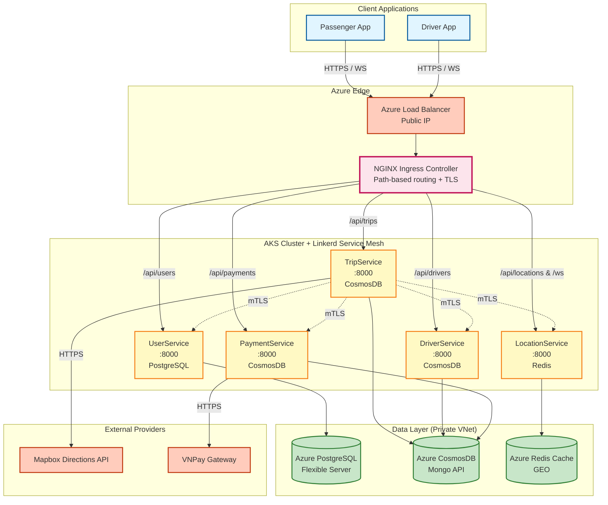
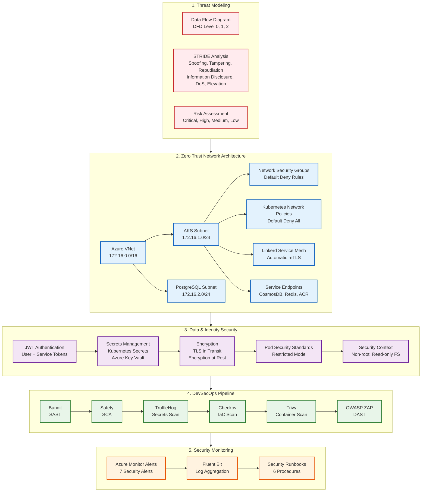

# UIT-Go: System Architecture

Tài liệu này mô tả kiến trúc microservices của UIT-Go với 2 sơ đồ chính: sơ đồ kiến trúc tổng quan và sơ đồ chi tiết cho module chuyên sâu (Security/DevSecOps).

## 📋 Table of Contents

- [System Overview](#system-overview)
- [Sơ đồ kiến trúc tổng quan](#sơ-đồ-kiến-trúc-tổng-quan)
- [Module chuyên sâu: Security & DevSecOps](#module-chuyên-sâu-security--devsecops)

---

## System Overview

UIT-Go là nền tảng gọi xe được xây dựng với **microservices architecture** sử dụng FastAPI và Python. Hệ thống bao gồm 5 services độc lập, mỗi service có database riêng và giao tiếp qua HTTP REST APIs và WebSocket.

### Core Design Principles

1. **Database per Service**: Mỗi service có isolated database (PostgreSQL hoặc CosmosDB)
2. **Service Independence**: Services có thể deploy và scale độc lập
3. **Zero Trust Security**: Network policies, mTLS, Pod Security Standards
4. **Centralized Authentication**: UserService cấp JWT cho cả user và service-to-service auth
5. **Redis for Geospatial**: LocationService sử dụng Redis GEO indexes cho nearby driver queries

### Service Matrix

| Service | Database | Port (K8s) | Responsibility |
|---------|----------|------------|----------------|
| **UserService** | PostgreSQL | 8000 | User authentication, JWT issuance (user + service tokens), user profiles |
| **TripService** | CosmosDB (Mongo API) | 8000 | Trip lifecycle, matching logic, orchestrates services, Mapbox integration |
| **DriverService** | CosmosDB (Mongo API) | 8000 | Driver profiles, driver wallet, internal APIs |
| **LocationService** | Redis GEO | 8000 | Real-time location tracking (Redis GEO), WebSocket connections, notifications |
| **PaymentService** | CosmosDB (Mongo API) | 8000 | User wallet, VNPay integration, payment processing & callbacks |

**Lưu ý:** Trong Kubernetes, tất cả services đều expose trên port 8000 bên trong cluster. Các ports khác nhau chỉ dùng cho local development với docker-compose.

---

## Sơ đồ kiến trúc tổng quan

### Phân tích Sơ đồ Tổng quan

#### 1. Client Layer
- **Passenger App** và **Driver App**: Mobile applications kết nối qua HTTPS và WebSocket
- Tất cả traffic đi qua **Azure Load Balancer** với public IP

#### 2. Edge Layer (API Gateway)
- **NGINX Ingress Controller**: Single entry point với path-based routing
  - `/api/users/*` → UserService
  - `/api/trips/*` → TripService
  - `/api/drivers/*` → DriverService
  - `/api/locations/*` và `/ws` → LocationService
  - `/api/payments/*` → PaymentService
- **TLS Termination**: HTTPS được terminate tại NGINX Ingress
- **Load Balancing**: Distribute traffic đến các service instances

#### 3. Service Layer (AKS Cluster)
- **5 Microservices**: Mỗi service độc lập, có thể scale riêng
- **Linkerd Service Mesh**: 
  - **Automatic mTLS**: Tất cả inter-service traffic được encrypt (dotted lines)
  - **Service Discovery**: Automatic với Kubernetes DNS
  - **Observability**: Metrics, logs, traces cho tất cả traffic
- **Port Standardization**: Tất cả services dùng port 8000 trong cluster

#### 4. Data Layer (Private VNet)
- **PostgreSQL**: UserService database, private VNet integration
- **CosmosDB**: TripService, DriverService, PaymentService databases, Service Endpoints
- **Redis**: LocationService cache và GEO indexes, VNet integration
- **Network Isolation**: Tất cả databases không exposed ra Internet, chỉ accessible từ AKS subnet

#### 5. External Integrations
- **Mapbox API**: TripService gọi để tính route và fare
- **VNPay Gateway**: PaymentService xử lý thanh toán và nhận callbacks

#### 6. Security Features
- **Zero Trust Network**: Network policies enforce default-deny, explicit allow
- **mTLS Encryption**: Linkerd tự động encrypt tất cả inter-service traffic
- **Private Database Access**: Databases chỉ accessible từ VNet, không public
- **TLS Everywhere**: External traffic qua HTTPS, internal traffic qua mTLS

---

## Module chuyên sâu: Security & DevSecOps

Module chuyên sâu tập trung vào việc thiết kế và xây dựng hệ thống an toàn theo triết lý **Zero Trust** (không tin tưởng bất kỳ ai), thay vì chỉ cấu hình các công cụ bảo mật.

### Phân tích Sơ đồ Module Chuyên Sâu

#### 1. Threat Modeling (Mô hình hóa Mối đe dọa)

**Data Flow Diagram (DFD):**
- **DFD Level 0**: Context diagram xác định external entities (Mobile App, Driver App, VNPay, Mapbox) và system boundary (AKS cluster)
- **DFD Level 1**: Service interactions giữa 5 microservices và databases
- **DFD Level 2**: Chi tiết các luồng quan trọng (authentication, payment, location tracking)

**STRIDE Analysis:**
- Phân tích 6 loại mối đe dọa cho từng component:
  - **Spoofing**: JWT giả mạo, WebSocket giả
  - **Tampering**: SQL injection, payload chỉnh sửa
  - **Repudiation**: Thiếu audit logs
  - **Information Disclosure**: PII rò rỉ, secrets trong logs
  - **DoS**: HTTP flood, brute force login
  - **Elevation of Privilege**: Pod chạy root, RBAC misconfiguration

**Risk Assessment:**
- **Critical**: CosmosDB & Redis public access → Mitigated bằng Service Endpoints
- **High**: Không có rate limiting, secrets không mã hóa → Mitigated bằng Network policies và Kubernetes encryption
- **Medium**: Pod chạy root, thiếu alerts → Mitigated bằng Pod Security Standards và Azure Monitor

**Kết quả:** Threat model được document trong `docs/threat-model.md` và review định kỳ hàng quý.

#### 2. Zero Trust Network Architecture

**Azure VNet Design:**
- **VNet**: `172.16.0.0/16` với 2 subnets:
  - **AKS Subnet** (`172.16.1.0/24`): Chứa AKS cluster nodes và NGINX Ingress
  - **PostgreSQL Subnet** (`172.16.2.0/24`): Chứa PostgreSQL Flexible Server với VNet injection

**Network Security Groups (NSGs):**
- **AKS Subnet NSG**: 
  - Inbound: Allow 80/443 từ Internet → NGINX Ingress, deny all else
  - Outbound: Allow HTTPS (443) cho external APIs, DNS (53)
- **PostgreSQL Subnet NSG**:
  - Inbound: Allow 5432 CHỈ từ AKS subnet (`172.16.1.0/24`), deny all else
  - Outbound: Deny all

**Kubernetes Network Policies:**
- **Default Deny All**: Tất cả traffic bị deny mặc định
- **Ingress Policy**: Chỉ allow từ NGINX Ingress và backend services (port 8000)
- **Egress Policy**: Chỉ allow DNS (53), service-to-service (8000), databases (5432, 10255, 6380), external HTTPS (443)

**Linkerd Service Mesh:**
- **Automatic mTLS**: Tất cả inter-service traffic được encrypt tự động
- **Certificate Rotation**: Tự động rotate mỗi 24 giờ
- **Observability**: Real-time metrics, logs, traces

**Service Endpoints:**
- CosmosDB, Redis, Azure Container Registry, Azure SQL chỉ accessible từ AKS subnet
- Không exposed ra Internet, đảm bảo private access

**Trade-off:** Zero Trust network architecture tăng bảo mật đáng kể nhưng làm tăng complexity khi debug. Cần có runbooks và tools để troubleshoot network issues.

#### 3. Data & Identity Security Perimeter

**JWT Authentication:**
- **User Tokens**: Generated bởi UserService sau khi verify credentials, expiry 30 phút
- **Service Tokens**: Generated với client credentials, có audience claim để prevent reuse, expiry 15 phút
- **Token Validation**: Check signature, expiration, type, và audience

**Secrets Management:**
- **Kubernetes Secrets**: Tất cả sensitive data (JWT secrets, DB passwords, API keys) được lưu trong Kubernetes Secrets
- **Encryption at Rest**: AKS native encryption cho Kubernetes Secrets
- **Azure Key Vault** (optional): Automatic rotation và audit logging

**Encryption:**
- **In Transit**: 
  - External traffic: TLS 1.2+ qua NGINX Ingress
  - Inter-service: mTLS qua Linkerd
  - Database: SSL/TLS required
- **At Rest**: 
  - Kubernetes Secrets: AKS native encryption
  - PostgreSQL, CosmosDB, Redis: Azure automatic encryption

**Pod Security Standards:**
- **Restricted Mode**: Enforced trên namespace
- **Non-root Execution**: Tất cả containers chạy với user ID 1000
- **Read-only Filesystem**: Prevent tampering
- **Capabilities Dropped**: Tất cả Linux capabilities bị drop
- **Resource Limits**: CPU và memory limits để prevent resource exhaustion

**Trade-off:** Restricted Pod Security Standards đảm bảo bảo mật cao nhưng có thể require code changes. Có Pod Security Exemptions cho workloads đặc biệt nếu cần.

#### 4. DevSecOps Pipeline

**6 OSS Security Tools trong CI/CD:**
1. **Bandit (SAST)**: Static Application Security Testing, phát hiện vulnerabilities trong Python code
2. **Safety (SCA)**: Software Composition Analysis, scan dependencies cho known vulnerabilities
3. **TruffleHog (Secrets)**: Detect exposed secrets trong code và Git history
4. **Checkov (IaC)**: Infrastructure as Code scanning, phát hiện misconfigurations trong Terraform
5. **Trivy (Container)**: Container image scanning, phát hiện vulnerabilities trong Docker images
6. **OWASP ZAP (DAST)**: Dynamic Application Security Testing, test runtime vulnerabilities

**Security Gates:**
- Fail fast cho CRITICAL/HIGH vulnerabilities
- Warn only cho MEDIUM/LOW vulnerabilities
- Prevent deployment nếu có exposed secrets

**Trade-off:** Security scans làm tăng build time ~6-8 phút, nhưng phát hiện vulnerabilities sớm và prevent security issues trong production.

#### 5. Security Monitoring

**Azure Monitor Alerts (7 Alerts):**
1. High CPU (>80%)
2. High Memory (>80%)
3. Pod Restart Loop
4. Node Not Ready
5. CosmosDB High Requests
6. Redis High CPU
7. Security Events (mTLS failures)

**Fluent Bit Log Aggregation:**
- Collect logs từ NGINX Ingress, microservices, Kubernetes events, Linkerd proxy
- Send đến Azure Log Analytics Workspace
- Retention: 30 days

**Security Runbooks (6 Procedures):**
1. High CPU Alert Response
2. High Memory Alert Response
3. mTLS Failure Troubleshooting
4. Database Connection Issues
5. Suspicious Login Detection
6. Security Incident Response

**Trade-off:** Comprehensive monitoring và alerting giúp phát hiện sự cố sớm nhưng tăng chi phí Azure Monitor. Cần optimize log retention và alert thresholds để balance cost và coverage.

---

## Tổng kết

Hệ thống UIT-Go được thiết kế với **Zero Trust Security Architecture** bao gồm:

1. **Threat Modeling**: Phân tích toàn diện các mối đe dọa và đề xuất mitigation
2. **Zero Trust Network**: Network isolation chặt chẽ với default-deny policies
3. **Data & Identity Security**: Encryption everywhere, least privilege, secure secrets management
4. **DevSecOps**: Shift-left security với 6 OSS tools trong CI/CD pipeline
5. **Security Monitoring**: Comprehensive monitoring và alerting với runbooks

**Trade-offs chính:**
- **Bảo mật vs Thuận tiện**: Zero Trust và Pod Security Standards tăng bảo mật nhưng làm tăng complexity khi debug
- **Chi phí vs Tính năng**: Service Endpoints miễn phí nhưng chỉ hoạt động trong cùng region; Private Endpoints có phí nhưng linh hoạt hơn
- **Hiệu năng vs Bảo mật**: Linkerd mTLS có overhead ~10ms và ~50MB RAM per pod nhưng đảm bảo encryption cho tất cả traffic

Tài liệu này được cập nhật khi kiến trúc thay đổi và được review định kỳ hàng quý.
