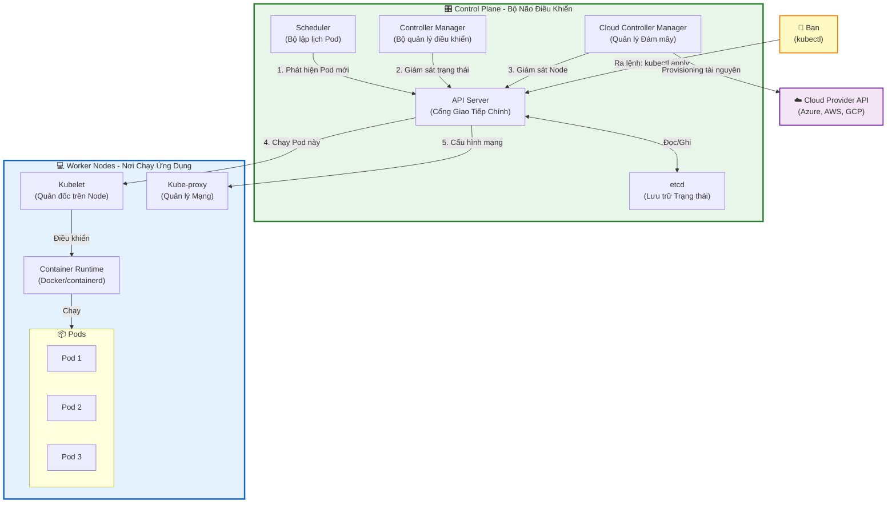

# Kubernetes Architecture - How It Works

## Sơ đồ luồng hoạt động của Kubernetes



## Giải thích chi tiết

### 🎛️ Control Plane (Bộ Não)

**1. API Server** - Cổng giao tiếp trung tâm
- Nhận tất cả requests từ kubectl, kubelet, và các components khác
- Validate và process requests
- Duy nhất component giao tiếp trực tiếp với etcd

**2. etcd** - Database của cluster
- Lưu trữ toàn bộ trạng thái cluster (Pods, Services, ConfigMaps...)
- Distributed, highly available
- Source of truth

**3. Scheduler** - Bộ lập lịch
- Watch API Server tìm Pods chưa được assign Node
- Quyết định Pod sẽ chạy trên Node nào
- Tính toán dựa trên: resources available, constraints, affinity rules

**4. Controller Manager** - Bộ quản lý
- Chạy nhiều controllers: Node Controller, Replication Controller, Endpoints Controller...
- Liên tục reconcile: desired state vs actual state
- Tự động sửa chữa khi có vấn đề

**5. Cloud Controller Manager** - Quản lý cloud resources
- Tương tác với Cloud Provider API (Azure, AWS, GCP)
- Tạo Load Balancer, attach Disks, manage Node lifecycle

### 💻 Worker Nodes (Nơi chạy ứng dụng)

**1. Kubelet** - Agent trên mỗi Node
- Nhận Pod specs từ API Server
- Đảm bảo containers đang chạy và healthy
- Report trạng thái về API Server

**2. Kube-proxy** - Network proxy
- Maintain network rules (iptables/IPVS)
- Implement Service abstraction
- Load balance traffic tới Pods

**3. Container Runtime** - Chạy containers
- Docker, containerd, CRI-O...
- Pull images, start/stop containers
- Manage container lifecycle

### 🔄 Luồng hoạt động khi tạo Pod

```
1. Bạn: kubectl apply -f pod.yaml
   ↓
2. API Server: 
   - Authenticate/Authorize
   - Validate Pod spec
   - Lưu vào etcd
   ↓
3. Scheduler phát hiện Pod chưa có Node:
   - Chọn Node phù hợp nhất
   - Gửi binding về API Server
   ↓
4. API Server update etcd: Pod được assign Node X
   ↓
5. Kubelet trên Node X phát hiện:
   - Pull image từ registry
   - Gọi Container Runtime
   - Start container
   ↓
6. Kubelet report status về API Server
   ↓
7. API Server update etcd: Pod đang running
```

## Ví dụ thực tế

### Tạo một Deployment

```bash
# 1. Bạn tạo file deployment.yaml
apiVersion: apps/v1
kind: Deployment
metadata:
  name: nginx-deployment
spec:
  replicas: 3
  selector:
    matchLabels:
      app: nginx
  template:
    metadata:
      labels:
        app: nginx
    spec:
      containers:
      - name: nginx
        image: nginx:1.14.2
        ports:
        - containerPort: 80

# 2. Apply
kubectl apply -f deployment.yaml

# 3. Kubernetes làm gì?
# - API Server nhận request
# - Lưu Deployment vào etcd
# - Deployment Controller tạo ReplicaSet
# - ReplicaSet Controller tạo 3 Pods
# - Scheduler assign Pods tới các Nodes
# - Kubelet trên mỗi Node pull image và start container
```

### Xem trạng thái

```bash
# Xem Pods
kubectl get pods -o wide
# NAME                                READY   STATUS    NODE
# nginx-deployment-66b6c48dd5-8j9zm   1/1     Running   node1
# nginx-deployment-66b6c48dd5-ks7pm   1/1     Running   node2
# nginx-deployment-66b6c48dd5-x8nhw   1/1     Running   node1

# Xem logs
kubectl logs nginx-deployment-66b6c48dd5-8j9zm

# Describe Pod
kubectl describe pod nginx-deployment-66b6c48dd5-8j9zm
```

## So sánh với các khái niệm dễ hiểu

| Kubernetes | Ví dụ thực tế |
|------------|---------------|
| **API Server** | Tổng đài điện thoại - nhận và chuyển tiếp mọi cuộc gọi |
| **etcd** | Sổ sách kế toán - ghi chép mọi thứ |
| **Scheduler** | Người phân công công việc - quyết định ai làm việc gì |
| **Controller Manager** | Giám sát viên - đảm bảo công việc được hoàn thành đúng |
| **Kubelet** | Công nhân - thực thi công việc trên mỗi máy |
| **Pod** | Container chứa ứng dụng - ngôi nhà cho app |
| **Service** | Địa chỉ nhà cố định - tìm được app dù Pod thay đổi |

## Tại sao Kubernetes mạnh mẽ?

✅ **Self-healing**: Tự động restart containers khi fail  
✅ **Auto-scaling**: Tự động tăng/giảm số Pods theo load  
✅ **Load balancing**: Phân phối traffic đều  
✅ **Rollout & Rollback**: Update ứng dụng an toàn  
✅ **Secret & Config management**: Quản lý cấu hình tập trung  
✅ **Storage orchestration**: Tự động mount storage  
✅ **Service discovery**: Tìm service qua DNS  

## Các lệnh kubectl hữu ích

```bash
# Xem tất cả resources
kubectl get all

# Xem chi tiết một resource
kubectl describe pod <pod-name>

# Xem logs
kubectl logs <pod-name>
kubectl logs -f <pod-name>  # Follow logs

# Exec vào container
kubectl exec -it <pod-name> -- /bin/bash

# Port forward
kubectl port-forward <pod-name> 8080:80

# Apply configuration
kubectl apply -f <file.yaml>

# Delete resource
kubectl delete pod <pod-name>
kubectl delete -f <file.yaml>

# Scale deployment
kubectl scale deployment <name> --replicas=5

# Rollout update
kubectl set image deployment/<name> container=image:tag
kubectl rollout status deployment/<name>
kubectl rollout undo deployment/<name>

# Debug
kubectl get events
kubectl cluster-info
kubectl top nodes
kubectl top pods
```

## Troubleshooting thường gặp

### Pod không start được

```bash
# 1. Xem trạng thái
kubectl get pods

# 2. Xem chi tiết
kubectl describe pod <pod-name>
# Xem phần Events để biết lỗi gì

# 3. Xem logs
kubectl logs <pod-name>

# Lỗi thường gặp:
# - ImagePullBackOff: Image không tồn tại hoặc không có quyền pull
# - CrashLoopBackOff: Container start rồi crash liên tục
# - Pending: Không đủ resources hoặc không có Node phù hợp
```

### Service không accessible

```bash
# 1. Kiểm tra Service
kubectl get svc
kubectl describe svc <service-name>

# 2. Kiểm tra Endpoints
kubectl get endpoints <service-name>
# Nếu không có endpoints -> label selector không match Pods

# 3. Test từ bên trong cluster
kubectl run test-pod --image=busybox -it --rm -- sh
wget -O- http://<service-name>:<port>
```

## Resources để học thêm

- [Kubernetes Official Docs](https://kubernetes.io/docs/)
- [Kubernetes Tutorial](https://kubernetes.io/docs/tutorials/)
- [kubectl Cheat Sheet](https://kubernetes.io/docs/reference/kubectl/cheatsheet/)
- [Play with Kubernetes](https://labs.play-with-k8s.com/)
- [KodeKloud Kubernetes Course](https://kodekloud.com/courses/kubernetes-for-beginners/)